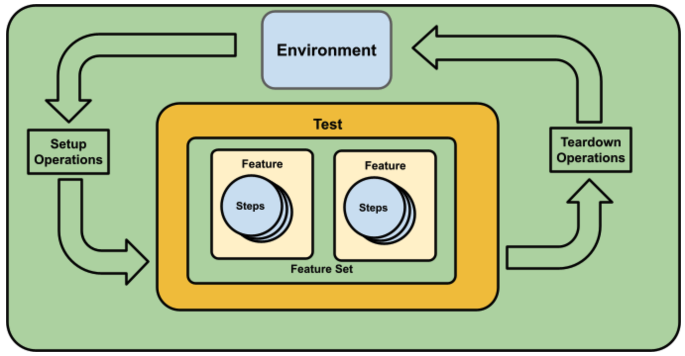

# Go E2E Test Framework for Kubernetes

This document captures high-level design ideas for the next generation of a Go framework for testing components running on Kubernetes. The framework, referred to as `e2e-framework` provides ways that makes it easy to define tests functions that can programmatically test components running on a cluster.  The two overall goals of the new framework are to allow developers to quickly and easily assemble end-to-end tests and to provide a collection of support packages to help with interacting with the API-server.

> See the original Google Doc design document [here](https://docs.google.com/document/d/11JKqcnUOrw5Lk98f_ylJXBXyxWSW1z3CZu27OLX1CbM/edit).

## Motivations
Currently, the existing E2E Test Framework is intrinsically baked into Kubernetes source code repository with organically grown assumptions, over the years, that shape how tests are created and executed.  This, however, has presented some shortcomings including:

* Difficulty (or even the impossibility) of consuming existing test framework packages from outside of the Kubernetes project
* Misaligned framework design can cause dependencies on unnecessary resources
* The requirements to use Ginkgo as a way to write tests

## Goals

* Properly documented framework to help with adoption
* Easily express end-to-end test and suites using the built-in Go testing package
* Rely and use Go testing package constructs to create test suites and test functions
* Tests should be go test(able)
* Provide sensible programmatic API components to compose tests
* Make test packages easily consumable programmatically
* Provide helper functions that abstracts Client-Go functionalities (i.e. similar to those found in kubernetes/kubernetes/test/e2e/framework repo).
* Rely on built-in Go test features to easily select/filter tests to run during execution
* Define optional standardized env/argument variables to control/pass data to tests
* Avoid direct dependencies on upstream k8s.io/kubernetes packages
* Avoid dependencies on cluster components (i.e. cluster-providers, CSI, CNI, etc)
* Move away from reliance on Ginkgo or other non-standard Go based tests packages

## Non-Goals

* Does not specify how tests are built and executed (i.e. e2e.test binary)
* Maintain backward compatibility with existing e2e test framework
* Not responsible for bootstrapping or executing the tests themselves (i.e. Ginkgo)
* Initially, this framework will not be responsible for hosting clusters infra components (i.e. Kubetest/Kubetest2)
* Excludes support for fake/mock cluster components for testing

## Design
The initial design of the end-to-end test framework, defined here, will be heavily inspired and influenced by the Knative reconciler-test framework which is a lightweight framework to easily compose end-to-end Kubernetes behavior testing.  This new design introduces several components that can be used to compose end-to-end tests as depicted below:

* Environment
* Environment operations
* Test features
* Feature step functions



### Environment
The environment component is the heart of the framework. It allows developers to define attributes and features to be tested (see Test Features below).  The environment uses callback functions to let developers implement customized behaviors before or after a test suite has been exercised.

The following shows a proposed type for the environment:

```go
// EnvFunc is an operation applied during/after environment setup
type EnvFunc func(context.Context, envconf.Config) (context.Context, error)

type Environment interface {
    // Config returns the associated environment configuration
    Config() envconf.Config
    
    // WithContext returns a new environment with an updated context
    WithContext(context.Context) Environment
    
    // Setup registers environment operations that are executed once
    // prior to the environment being ready and prior to any test. 
    Setup(EnvFunc...)

    // BeforeTest registers funcs that are executed before each Env.Test(...)
    BeforeTest(EnvFunc...)
    
    //Test executes a test feature
    Test(*testing.T, features.Feature)
    
    // AfterTest registers funcs that are executed after each Env.Test(...)
    AfterTest(EnvFunc...)
	
    // Finish registers funcs that are executed at the end.
    Finish(EnvFunc...)

    // Launches the test suite from within a TestMain
    Run(*testing.M) int
}
```

#### Environment package
This design assumes that the `Environment` type and associated functions are hosted in a package called `env`.

#### Environment constructor functions
The `Environment` type could be created with the following constructor functions:
```go
// env.New creates a new env.Environment with default context.Context 
// and environment config
env.New() Environment

// env.NewWithConfig creates env.Environment with a specified 
// environment config and a default context.Context
env.NewWithConfig(envconf.Config) Environment

// env.NewWithContext creates an environment with a specified
// environment Config and context.Context
env.NewWithContext(context.Context, envconf.Config) (Environment, error)
```

### `env.Environment` and context.Context
Before an `Environment` can be used to run tests, it goes through several stages including configurations, feature definitions, and feature testing. During the entire lifetime of these cycles, a context can be used to inject control, signaling, or pass data into each phase.

> The context propagation strategy used in this design is similar to how it is done in package [net/http](https://pkg.go.dev/net/http).


#### Propagating environment context
This framework is designed for a context to be injected early during the construction of the `Environment` value (see constructor functions above). A context can optionally be provided using constructor function `env.NewWithContext`. All other constructor function shall create a default context internally.

#### Updating the `Environment` context
In some instances, it will be necessary to update a previously injected (or the default) context. To update an environment's context, after the environment has been already created, test writers should use `Environment.WithContext` method to update the context and get a new environment with the newly updated context.

```go
origEnv := env.New()

// new Env with new context
newEnv := origEnv.WithContext(context.TODO())
```

#### Accessing an `Environment`'s context
After an environment has been initialized, its context can be accessed at any time using the `Environment.Context` method.

```go
ctx := env.New().Context()
```

### Environment Operations
Test writers can specify an environment operation using type `EnvFunc`.

```go
type EnvFunc func(context.Context, envconf.Config) (context.Context, error)
```

An environment operation can be applied at different stages during the life cycle of the environment including environment setup, before a test, after a test, and to tear down the environment. At runtime, the environment operation will receive the environment context that was injected at construction time (or the default context). The context's content (key/value) can be mutated during the operation and returned.

```go 
e := env.New()
e.Setup(func(ctx context.Context, client conf envconf.Config){
  // define environment operation here
})
```

### Test Features
A test feature represents a collection of testing steps that can be performed as a group for a given feature. A feature shall have the following attributes:

* *Name* - an arbitrary name that identifies the feature being tested.  The string value can be used as part of a filtering mechanism to execute features matching this value.
* *Labels* - string values used to label the feature (i.e. “alpha”, “conformance”, etc).
* *Steps* - actions that can be performed at different phases of a feature test.

A feature shall be represented by the Feature type as shown below:

```go
type Feature interface {
	// Name is a descriptive text for the feature
	Name() string
	// Labels are used to label the feature (beta, conformance, etc)
	Labels() Labels
    // Steps are feature operations (see Execution Step)
	Steps() []Step
}
```
#### Feature labels
A feature can receive an arbitrary label as a hint about the nature of the feature being tested.  For instance, the followings could be used as labels:

* `level`: alpha
* `conformance`: Beta
* `type`: network

A feature state shall be encoded using the following type and constant values:

```go
type Labels map[string]string
```

### Execution steps
An execution step is a granular operation that can be declared and combined to perform user-defined actions for the feature.  An execution step has the following attributes:

* *Name* - a string describing the step
* *Step* function - implements user-defined operations to be executed by the step

The following interface shows a Step.:

```go
type Step interface {
    // Name is the step name
    Name() string
    // Func is the operation for the step
    Func() StepFunc
    // Level indicates a framework-defined level for the step
    Level() Level
}
```

#### The step function
The operation performed during an execution step is defined as the following Go function:

```go
type StepFunc func (context.Context, *testing.T, envconf.Config) context.Context
```

When a step is executed, it will receive the last updated `context.Context`, `*testing.T` for test signaling, and the `envconf.Config` that is associated with the environment. Note a step function can update the content of the context and return it so that its value will be passed to subsequent steps.

#### Step levels
A step level identifies the type of a step.  It shall be encoded as the following type, shown below.

```go
type Level uint8

const (
    Setup Level = iota
    Assessment
    Teardown
)
```

## Using the Framework
When implemented, the framework will come with many packages along with helper types to facilitate the creation, running, and tearing down feature tests. This section shows an example of a possible implementation by outlining the steps necessary to create and run feature tests.

### Setting up a test suite
The starting point for an E2E test is a Go TestMain function which can launch all test functions in the package (or test suite).  The following snippet shows how a new `Environment` could be set up with using a provided `klient.Config` value.

```go
import (
    "sigs.k8s.io/e2e-framework/pkg/env"
    conf "sigs.k8s.io/e2e-framework/klient/conf"
)

var (
    global env.Environment
)

func TestMain(m *testing.M) {
    // creates a test env with default
    // configuration (i.e. default k8s config)
    global = env.New()
    ...
}
```

In the snippet above, the environment configuration instance is made global because the Go’s test framework has no easy way of injecting values into a running test functions.

### Specifying environment operations
Using an `environment` instance, a test author shall be able to register operations (functions), of type `EnvFunc`, that are applied at different stages of the test lifecycle.  For instance, during environment setup, the `Setup` method can be used to register a function to set up environment resources.

```go
import (
    "sigs.k8s.io/e2e-framework/pkg/env"
    "sigs.k8s.io/e2e-framework/pkg/envconf"
)

var (
    global env.Environment
)

func TestMain(m *testing.M) {
    global = env.New()    
    global.Setup(func(context.Context, cfg *envconf.Config) (context.Context, error){
        // code to setup environment
        return nil, nil
    })
    ...
}
```

### Launching the suite
After the test environment is configured, it is ready to be launched using the `Environment.Run` method which will execute all test functions defined in the current package where it is located.

```go
import (
    "sigs.k8s.io/e2e-framework/pkg/env"
    "sigs.k8s.io/e2e-framework/pkg/envconf"
)

var (
    global env.Environment
)

func TestMain(m *testing.M) {
    global = env.New()    
    global.Setup(func(context.Context, *cfg envconf.Config) (context.Context, error){
        // code to setup environment
        return nil, nil
    })
    ...
    os.Exit(global.Run(m))
}
```

### Creating a test
To test a feature, the framework uses a plain Go test function.  Test authors  would simply create a test function as shown:

```go
func TestSomething(t *testing.T) {
    ...
}
```

Then within that function test authors would declare the feature and use the previously created environment to test the features.

### Defining a new feature
Before a feature can be tested, it must be defined.  Assuming that the framework provides a package named `feature`, with a fluent API, to declare and set up a `feature`, the following snippet shows how this would work:

```go
func TestSomething(t *testing.T) {       
    feat := features.New("Hello Feature").
        Assess("Simple test", func(ctx context.Context, t *testing.T, cfg *envconf.Config) context.Context {
            result := "foo"
            if result != "Hello foo" {
                t.Error("unexpected message")
            }
            return ctx
        }).Feature()   
...
}

```
The snippet above creates feature `feat` and with an Assessment `StepFunc` function.

### Testing the feature
Next the feature can be tested.  This is done by invoking the `Test` method on the `global` environment.

```go
func TestSomething(t *testing.T) {
    feat := features.New("Hello Feature").
        Assess("Simple test", func(ctx context.Context, t *testing.T, cfg *envconf.Config) context.Context {
            result := "foo"
            if result != "Hello foo" {
                t.Error("unexpected message")
            }
            return ctx
        }).Feature()
        
    global.Test(t, feat)
}
```

The environment component will run the feature test passing each execution step function a context, a `*testing.T` and `envconf.Config`.

### Finishing and clean up
After all tests in the package (or suite) are executed, the test framework will automatically trigger any teardown operation specified as `Environment.Finish` method, as shown below.

```go
func TestMain(m *testing.M) {
    ...
    env.Setup(func(ctx context.Context, cfg *envconf.Config) (context.Context, error){
        // setup environment
        return ctx, nil
    })

    env.Finish(func(ctx context.Context, cfg *envconf.Config) (context.Context, error){
        // teardown environment
        return ctx, nil
    })
    ...
}
```

## Examples
The following shows actual examples of how the early implementation of this framework could work.

### Simple feature test

The following shows how a feature test can be defined outside of a test suite (TestMain).

```go
func Hello(name string) string {
	return fmt.Sprintf("Hello %s", name)
}

func TestHello(t *testing.T) {
    e := env.New()
    
    feat := features.New("Hello Feature").
        WithLabel("type", "simple").
        Assess("test message", func(ctx context.Context, t *testing.T, conf envconf.Config) {
            result := Hello("foo")
            if result != "Hello foo" {
                t.Error("unexpected message")
            }
        }).Feature()
        
    e.Test(context.TODO(), t, feat)
}
```

### Test in a Suite
This example shows how a test can be setup in a suite (package test with TestMain).  First, the following shows the definition for TestMain. Note that for now, in order to make the same context visible to the rest of the test functions, it has to be declared as a global package variable, similar to the environment variable.

```go
var (
	testenv env.Environment
)

func TestMain(m *testing.M) {
    ctx = context.WithValue(context.TODO(), 1, "bazz")
    testenv = env.NewWithContext(ctx, envconf.New())
    // run suite
    os.Exit(testenv.Run(m))
}
```

The next code snippet shows how the test function could be defined to be used in the suite:

```go
func Hello(name string) string {
	return fmt.Sprintf("Hello %s", name)
}

func TestHello(t *testing.T) {
    feat := features.New("Hello Feature").
        WithLabel("type", "simple").
        Assess("test message", func(ctx context.Context, t *testing.T, _ envconf.Config) context.Context{
            name := ctx.Value(1).(string)
            result := Hello(name)
            if result != "Hello bazz" {
                t.Error("unexpected message")
            }
        return ctx
    }).Feature()

    testenv.Test(t, feat)
}
```

## Running the tests
The test framework is designed to completely rely on the Go test tool and its functionalities. Running a test shall only require constructs supported by the Go’s compiler and test framework tools.

### Tagging test binaries
If a feature test is part of a larger code base with many different types of tests (i.e. unit), it could be useful to tag the `MainTest` function with an arbitrary compiler tag as follows:

```go
// +build app1-e2e

var (
    global env.Environment
)

func TestMain(m *testing.M) {
    global = env.New()
    ...
    os.Exit(global.Run(m))
}
```

When running the test (or building a binary), only the e2e tests will be selected:

```go
go test -timeout=15m -tags=app1-e2e ./test/...
```

### Filtering feature tests
The test framework should provide mechanism to filter (in or out) features to be tested based on the following criteria:

For instance, the following shows a test being filtered to exercise only features with name “special”
```go
go test -tags=e2e ./test/... --feature="special"
```

The framework shall provide predefined flagsets that will be automatically applied during test execution. Possible filters that could be supported by the framework implementation:

* `--feature` - a regular expression that target features to run
* `--assess` - a regular expression that targets the name of an assessment steps
* `--labels` - a comma-separated list of key/value pairs  used to filter features by their assigned labels

The framework should automatically inject these filter values into the environment component when it is created.

### Skipping features
The test framework should provide the ability to explicitly exclude features during a test run.  This could be done with the following flags:

* `--skip-features` - a regular expression that skips features with matching names
* `--skip-assessment` - a regular expression that skips assessment with matching name
* `--skip-labels` - a comma-separated list of key/value pairs used to skip features with matching labels

## Test support
Another important aspect of the test framework is to make available a collection of support packages to help definition of environment and step functions.

For instance, assuming a `support` package is part of the framework, the following shows examples of pre-defined environment and step functions that could come with the framework:

* `support/kind.CreateCluster("name")`
* `support/kind.DestroyCluster("name")`
* `support/k8s.CreateWithYamlFile(yamlFilePath)`
* `support/k8s.DeleteWithYamlFile(yamlFilePath)`
* `support/k8s.ApplyYamlText(string)`
* `support/k8s.CreateGenericSecret(...)`
* `support/k8s.CreateFilesSecret(...)`
* `support/k8s.DeleteSecret(...)`
* `support/k8s.RunPod(name, imageName)`
* `support/k8s.DeletePod(name)`
* Etc.

## Resources
* E2E Test Framework 2 Repo - https://github.com/kubernetes-sigs/e2e-framework
* Helper package for test - https://docs.google.com/document/d/1ZtN58kU8SKmDDkxeBKxR9Un76eqhszCVcZuqhs-fLIU/edit#
* Official E2E Test Framework  doc - https://github.com/kubernetes/community/blob/master/contributors/devel/sig-testing/e2e-tests.md
* Kubernetes.io blog on using the current test framework  - https://kubernetes.io/blog/2019/03/22/kubernetes-end-to-end-testing-for-everyone/
* Knative Reconciler Test Framework - https://github.com/knative-sandbox/reconciler-test
* Contour Integration Test Harness - https://github.com/projectcontour/contour/issues/2222
* Integration Tester for Kubernetes - https://github.com/projectcontour/integration-tester
* https://github.com/kubernetes-sigs/ingress-controller-conformance
